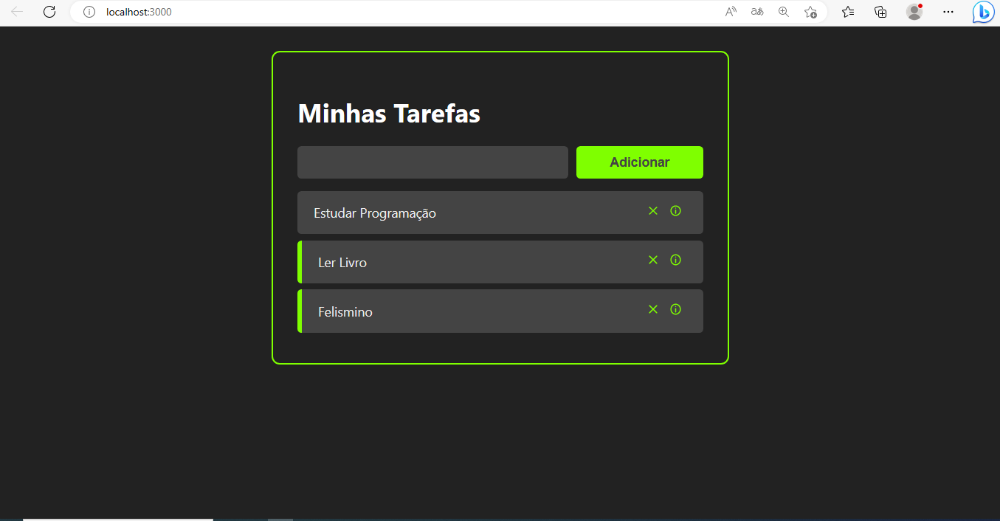

# Gestor de Tarefas

A aplicação consiste em armazenar as tarefas, eliminar tarefas, e ver os detalhes de uma determinada tarefa.

## Layout do Projecto



# Tecnologias utilizadas
## Front end
- HTML / CSS / JS 
- ReactJS

## Front end web
Pré-requisitos: npm / yarn

```bash
# clonar repositório
git clone https://github.com/Felismino2022/gestor_de_tarefas_react.git


# instalar dependências
npm install

# executar o projeto
npm start
```

# Autor

Felismino Muchombo
